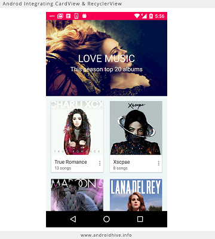

# CardView
>Android CardView

When the data such as music library,vedios,pictures are to be setup in form of cards
##Getting Started
These instructions will get you a copy of the project up and running on your local machine for development and testing purposes.

###Example Usage
```
When CardView are to be added in the app
```
###Technology Required 
* Android SDK version 2.1+
* JDK 7+

###Installing
1. Install JDK
2. Install Android Studio

## How to set dev environment
1. set dependency compile'com.android.support:cardview-v7:21.0.+'
2. set dependency compile'com.android.support:recyclerview-v7:21.0.+'

##Contribute
Contributions are always welcome!
Please read the [contribution guidelines](contributing.md) first.

##License
[MIT License](LICENSE)


